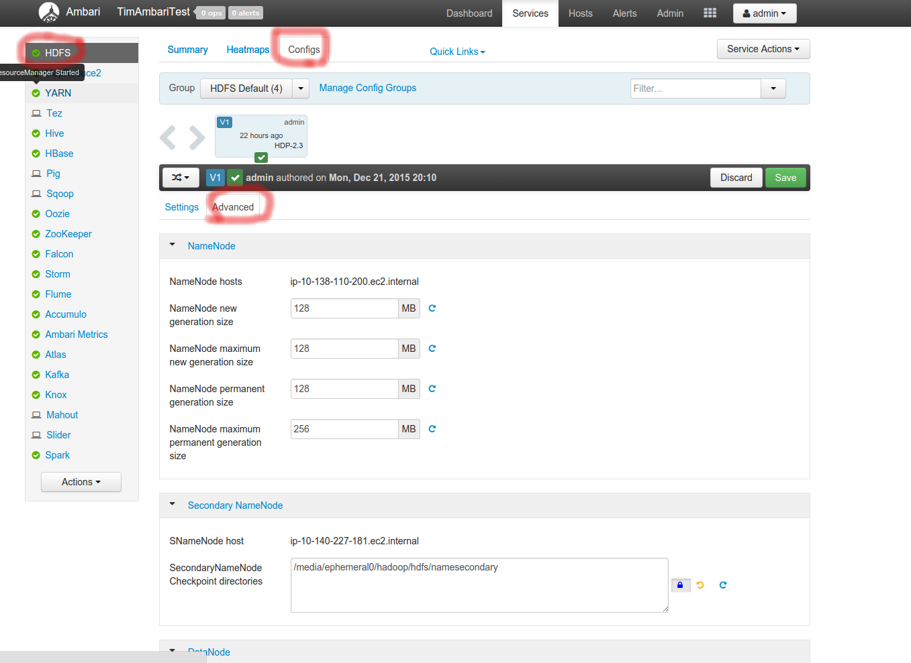
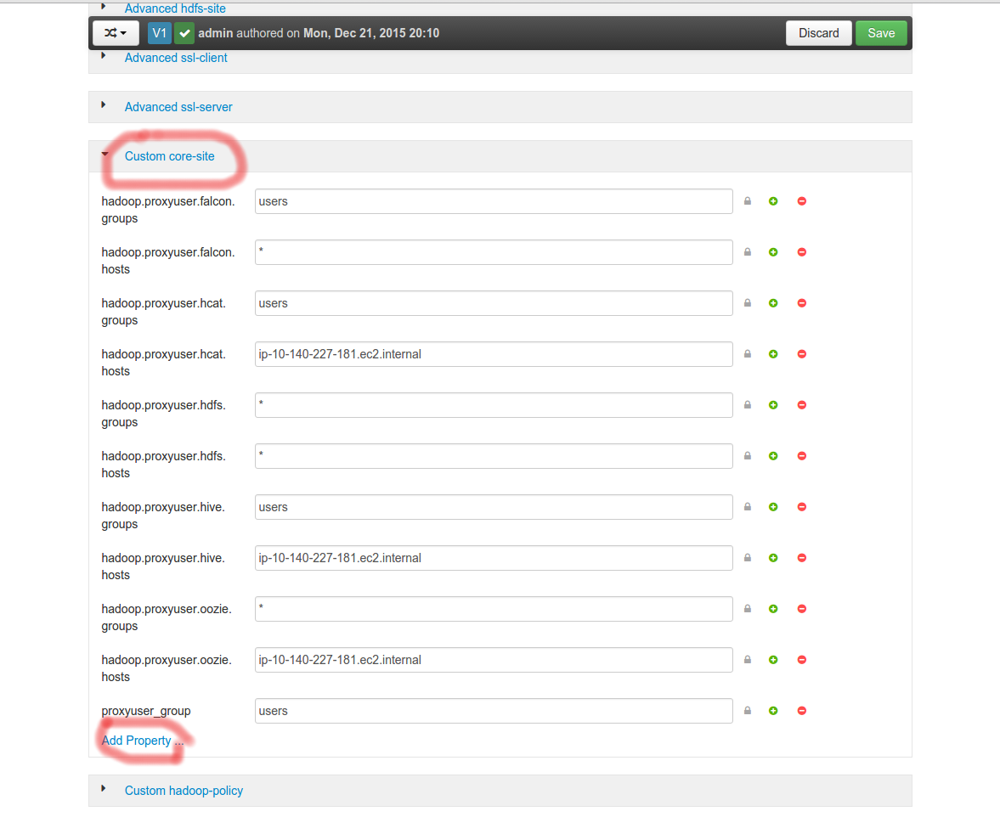
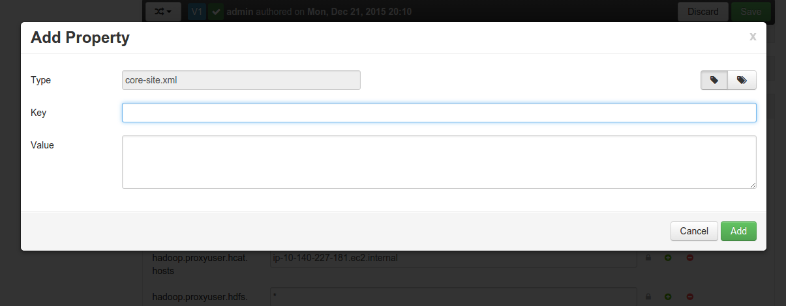

Installing Ambari Views
=======================

First, Install Ambari as shown in the lab

Create a new user in ambari for ec2-user.

While the default login is admin/admin, create another admin-level user
in Ambari for ec2-user password (please get from instructor).

Ensure that you have run the following in at the linux command line:

```bash
sudo -u hdfs  hdfs  dfs -mkdir /user/$USER
sudo -u hdfs  hdfs  dfs -chown $USER  /user/$USER
```

Also, you should set up a home directory for the default "admin" user, in 
case you log in as "admin" in ambari.

```bash
sudo -u hdfs hadoop fs -mkdir /user/admin
sudo -u hdfs hadoop fs -chown admin:hadoop /user/admin
```


Configuring HDFS for  Views

To do this, you should go to Ambari, and log in (admin/admin) by default
Then, Click on the HDFS on the left hand navigation bar.


You need to set up an HDFS proxy user for the Ambari daemon account. For example, 
if ambari-server daemon is runnng as root, you set up a proxy user for root in 
core-site by adding and changing properties in HDFS > Configs > Custom core-site:


Go to The Configs tab.   Then, underneath you will see tabs for "Settings"
and "Advanced."  Click on Advanced.  You should see the following as 
per the screenshot.



Then expand "Custom core-site." You should see something like this:



Then click on "Add Property..." You should see something like this:




Here you can add all of the following properties:

```
hadoop.proxyuser.root.groups=*
hadoop.proxyuser.root.hosts=*
hadoop.proxyuser.admin.groups=*
hadoop.proxyuser.admin.hosts=*
hadoop.proxyuser.ec2-user.groups=*
hadoop.proxyuser.ec2-user.hosts=*
```


If you are adding additional users (other than admin or ec2-user)
You will need to add in similar configs for those users too.

Similarly the following will need to be added (or more likely) they
already exist but need to be modified.

```
hadoop.proxyuser.hcat.groups=*
hadoop.proxyuser.hcat.hosts=*
```

Go to the left navigation bar and click on Hive, and proceed to the 
Configs tab, then Advanced (similarly to how you did this for the
Files View.

Go to custom webhcat-site -> Add Property

webhcat.proxyuser.root.groups=*
webhcat.proxyuser.root.hosts=*

Restart the required components as indicated by Ambari. If you want to 
add multiple views, you can restart services once, after making changes for all views.

It is very imporatant to ensure no stale configs are left. Keep restarting
all services (HDFS, Hive, etc) until all stale configs are gone.

Create the Files View

Once finished, it is itme to create the files view.  Go to the the top, find
user user name (likely "admin"), and then the dropdown has the second item as
"Manage Ambari."   This takes you to the Administration View.

From there, Click button Views under the "Deploy Views" section.

Expand the "Files" section.  If one is not already present, click on "Create Instance"

This brings up the Views / Create Instance page.  

Enter the following:

 * Instance Name: whatever internal you want to call it, here "FILES_1" is fine.
 * Display Name: The name displayed to the user "MYFILES" is fine.
 * Description: This can be a long description but is optional.
 * WebHDFS Username: Should already be filled in as ${username}, so leave as this.
 * WebHDFS Authorizaiton: Should already be filled in, auth=SIMPLE 

For an Ambari Managed cluster, you should be able to select "Local Ambari Managed Cluster"

Click save.  After this, it will ask you to modify permissions. Add full permisisons for ec2-user.

The Files View should now be there. To view it, there is a matrix of 
square (the apps section) on the top navigation bar, next to the 
logged in user name ("admin"), from there, you can select the files view.


==Installing the Pig View

First,  follow all the above steps for Files View before doing this one.

Go back to Manage Ambari, then go to Views then "Deploy Views"

As Before, locate the Pig Section.  If an instance is not already there,
click on "Create View".

This brings up the Views / Create Instance page.  

 * Instance Name: whatever internal you want to call it, here "PIG_1" is fine.
 * Display Name: The name displayed to the user "PIGView" is fine.
 * Description: This can be a long description but is optional.
 * WebHDFS Username: Should already be filled in as ${username}, so leave as this.
 * WebHDFS Authorizaiton: Should already be filled in, auth=SIMPLE 
 * Scripts HDFS Directory: already filled in as /user/${username}/pig/scripts, but you can change to suit.
 * Jobs HDFS Directory: Already filled in as /user/${username}pig/jobs, but you can change to suit.

Click save.  After this, it will ask you to modify permissions. Add full permisisons for ec2-user.


==Installing the Hive View

First,  follow all the above steps for Files View before doing this one.

Go back to Manage Ambari, then go to Views then "Deploy Views"

As Before, locate the Hive Section.  If an instance is not already there,
click on "Create View".

This brings up the Views / Create Instance page.  

 * Instance Name: whatever internal you want to call it, here "HIVE_1" is fine.
 * Display Name: The name displayed to the user "Hive" is fine.
 * Description: This can be a long description but is optional.

The defaults for everythign else should be fine.

==Running Your Views


